# 架构说明

本文档说明玩机工具箱（Modbench）的整体结构、主要数据流和模块依赖关系。接口细节见 [API 文档](api.md)。

## 整体架构

工具由三部分组成：浏览器中运行的前端单页应用、电脑上运行的 Node.js 后端，以及通过 USB 连接的 Android 设备。前端不直接接触 adb，所有设备操作都经后端转换为 adb 命令执行。

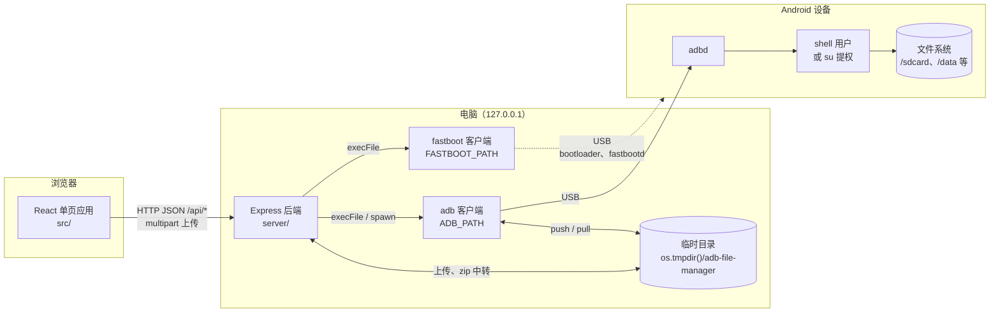

要点：

- 后端只监听 `127.0.0.1`，并通过 `guard.ts` 中的 `localOnly` 校验 Host、Origin 和 Sec-Fetch-Site，拒绝来自其他主机或其他网页的请求
- 列目录、新建、重命名、删除、复制、移动均通过 `adb shell` 在设备端执行；路径在拼接进命令前经过单引号转义（`adb.ts` 中的 `q`）
- 上传经电脑临时目录中转：先由 multer 接收到临时目录，再 `adb push`。下载单个文件时用 `adb exec-out cat` 直接流式返回，不落盘；目录和多选先 `adb pull` 到临时目录再打包为 zip。压缩为 zip 同样经临时目录：拉取、打包后推回设备；压缩为 tar 系格式则直接在设备上完成
- 预览（含 Range 分段读取）使用 `adb exec-out` 直接以字节流返回，不经过临时目录；文本预览读取文件开头 1 MB
- root 模式下，若 adbd 本身以 root 运行则直接执行；否则以 `su -c`（可由 `ADBFM_SU` 修改）包装命令。su 模式下 `adb push` / `adb pull` 本身没有 root 权限，因此再经设备上的 `/data/local/tmp` 中转一次

### 开发与生产两种运行方式

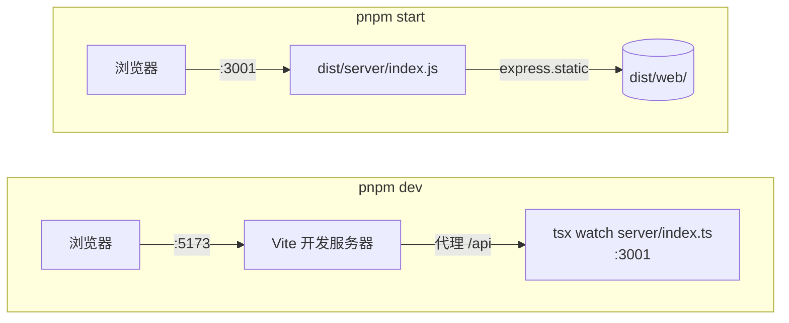

开发时页面由 Vite 提供，`/api` 请求代理到 3001 端口的后端。构建后后端同时托管 `dist/web/` 中的前端产物，`/api/` 以外的路径一律返回 `index.html`。

## 后端结构

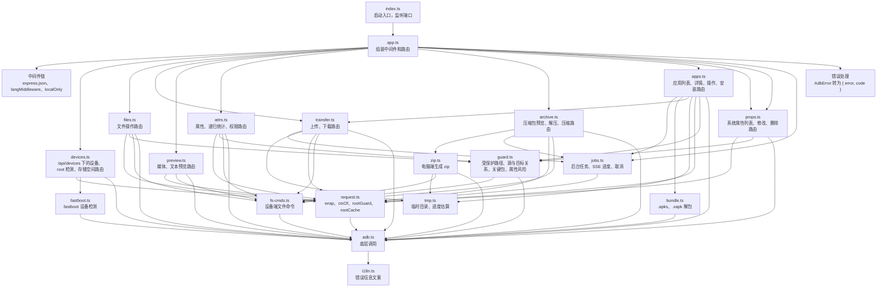

| 模块 | 职责 |
| --- | --- |
| `index.ts` | 读取 `PORT`，先清理电脑临时目录，再在 `127.0.0.1` 上启动服务 |
| `app.ts` | 注册中间件，把设备路由挂在 `/api/devices`、文件相关的五组路由挂在 `/api/files`、应用路由挂在 `/api/apps`、属性路由挂在 `/api/props`、任务路由挂在 `/api/jobs`，并托管静态文件、统一处理错误；各 Router 内写相对路径，新模块照此挂载 |
| `devices.ts` | `deviceRoutes()`：`GET /api/devices`（`listDevices()` 合并 adb 和 fastboot）、`/api/devices/reconnect`、`/api/devices/restart-server`、`/api/devices/root-check`、`/api/devices/storage`；`storage` 读取存储空间 |
| `files.ts` | `/api/files/ls`、`/api/files/mkdir`、`/api/files/rename`、`/api/files/delete`、`/api/files/copy`、`/api/files/move` |
| `preview.ts` | `/api/files/preview`（媒体文件，支持 Range）、`/api/files/text`（文件开头 1 MB 的 UTF-8 文本）；`parseRange`、`decodeText` 为可单独测试的纯函数 |
| `attrs.ts` | `/api/files/stat`（属性、符号链接目标、所在分区）、`/api/files/usage`（文件夹递归统计，可取消，超时 120 秒）、`/api/files/chmod`、`/api/files/chown`；`parseStat`、`parsePartition`、`parseUsage` 为可单独测试的纯函数，`stat -c` 的格式依次降级以兼容老设备 |
| `apps.ts` | `/api/apps`（应用列表，一次 shell 取全部包、系统包、已停用包、已安装包、默认启动器和当前输入法六段，并标出关键包）、`/api/apps/info`（解析 `dumpsys package` 得到版本、安装信息和权限）、应用操作（`uninstall`、`uninstall-updates`、`restore`、`disable`、`enable`、`force-stop`、`clear`，由表驱动的 `APP_OPS` 生成）、`/api/apps/extract`（提取 APK 的任务）和 `/api/apps/install`（安装任务）；不接受 `root`，一律作用于用户 0。`assertPackage` 校验包名，`pmRun` 执行 pm 命令并经 `pmFailure` 识别失败输出，`installFailure` 把 `INSTALL_FAILED_*` 转为说明，`currentDefaults` 在服务端复查当前启动器和输入法，`listCmd`、`defaultsCmd`、`parsePackageLine`、`parseAppList`、`parseDefaults`、`parseAppDetail` 为可单独测试的纯函数；已卸载指系统应用被 `pm uninstall --user 0` 移除，即不在 `pm list packages` 的结果中 |
| `props.ts` | `propRoutes()`：`GET /api/props`（`getprop`，root 时同一次 shell 里追加 resetprop 检测）、`POST /api/props/set`、`POST /api/props/delete`；支持 `root`。`assertPropKey` 校验键名并拒绝控制属性（`ctl.*`、`sys.powerctl`），`assertPropValue` 校验值，`parseProps` 解析 `getprop`（多行值并入上一项），`listCmd`、`setCmd`、`deleteCmd` 拼命令（键和值经 `q()`，`ro.*` 与删除经设备端函数 `adbfm_resetprop`，按 PATH、KernelSU、APatch、`magisk resetprop` 的顺序查找），`propFailure` 识别 setprop 和 resetprop 的失败输出，设置后回读 `getprop` 校验是否生效。有风险的操作经 `guard.ts` 的 `assertPropForce` 返回 `409` 和 `needs_force`，这是“后端返回风险说明，前端强确认后带 `force` 重试”的通用约定，settings 接口沿用 |
| `bundle.ts` | `readBundle`：用 `yauzl` 读取 `.apks`、`.xapk`，把根目录的 `*.apk` 和 XAPK 清单声明的 OBB 解到任务目录；含 `toc.pb` 的 bundletool 产物不支持；OBB 的目标路径必须位于 `Android/obb/<包名>/` 之下且不含 `..`，本机路径不得越出任务目录；`localApkName` 把文件名限制为安全字符，adb 会把它拼进设备端命令 |
| `archive.ts` | `/api/files/archive`（压缩包内的条目，最多 20000 个）、`/api/files/extract`（在设备上解压）、`/api/files/compress`（启动压缩任务，zip 或 tar 系格式）；`archiveFormat`、`parseZipList`、`parseTarList`、`assertSafeEntries`、`topLevelSingle`、`extractName`、`packBase`、`packName` 为可单独测试的纯函数，其中 `assertSafeEntries` 拒绝绝对路径、`..` 和符号链接之下的条目，`packBase` 去掉重复和互相包含的所选项并确定压缩包的位置 |
| `zip.ts` | zip 的电脑端生成：`compressZip` 接收 `JobHandle`，依次预估空间、`adb pull`、打包、`adb push` 并切换任务阶段（推送阶段不可取消），`buildZip` 用 `archiver` 写出 zip（支持 `signal` 取消和进度回调），已压缩的格式直接存储 |
| `jobs.ts` | 通用后台任务：`startJob(req, run)` 生成 id 后立即返回，`run` 在后台执行并通过 `JobHandle`（`signal`、`phase`、`progress`、`log`）报告阶段、进度和日志；`jobRoutes()` 提供 `/api/jobs/:id/events`（SSE）和 `/api/jobs/:id/cancel`。任务保存在内存中，结束后保留 60 秒；异常经 `request.ts` 的 `rootGuard` 复查，`signal` 已触发时记为取消；进度推送限流到约 250 毫秒一次 |
| `tmp.ts` | 电脑临时目录 `os.tmpdir()/adb-file-manager` 及其中任务目录的创建，供 `transfer.ts` 和 `zip.ts` 使用；`cleanTmp` 在启动时清空残留（默认同一时间只运行一个服务实例）；`dirBytes`、`watchGrowth` 按目录增长估算 `adb pull` 的进度 |
| `transfer.ts` | `/api/files/upload`、`/api/files/pull`（启动下载任务）、`/api/files/fetch/:token`；管理下载 token（单个文件流式返回，其余 pull 后打包 zip）和临时目录；`registerPull` 已导出，应用的“提取 APK”用它登记下载 |
| `request.ts` | 解析 `serial`、`root`、`paths` 参数；缓存每台设备的 root 方式；root 请求失败时复查并转换为 `root_lost`（`rootGuard` 同时供 `jobs.ts` 使用） |
| `guard.ts` | 仅限本机访问；禁止删除、移动，以及修改权限或所有者的目标为根目录、一级目录、存储根目录等路径；禁止把目录复制或移动到自身内部；`CRITICAL_PACKAGES`、`criticalRole`、`assertNotCritical` 把系统核心组件、当前启动器和输入法标为关键包，卸载、停用、清除数据、卸载更新前必须带 `force`；`propRisk`、`assertPropForce` 把 `ro.*` 和会断开 adb 的属性（`ADB_PROPS`）标为有风险，删除属性总是有风险，没有 `force` 时返回 `409` 和 `needs_force` |
| `fastboot.ts` | fastboot 的底层调用（`execFile` 传参数数组，路径取自 `FASTBOOT_PATH`）和设备检测：`devices()` 解析 `fastboot devices -l`，设备首次出现时查询一次 `getvar is-userspace` 和 `product` 并按 serial 缓存，消失时清除；fastboot 不存在时返回 `missing`；`parseFastbootDevices`、`parseGetvar` 为可单独测试的纯函数 |
| `adb.ts` | 底层调用：`run`、`shell`、`checked`（含 `OK_MARK`、`EXISTS_MARK`）、exec-out 封装（`execOutStream`、`execOutBuffer`）、`q` 转义、`Ctx`、`AdbError`；`install`（单个用 `install -r`，分包用 `install-multiple -r`，输出无 `Success` 视为失败），以及设备列表（`parseAdbDevices`、`adbMode` 为纯函数，`cachedName` 供 fastboot 复用名称缓存）、root 检测、push、pull、设备端暂存目录清理。除 `adb.ts` 和 `fastboot.ts` 外，其他模块不直接调用 `child_process` |
| `fs-cmds.ts` | 设备端文件命令，基于 `adb.ts` 拼接：列目录、改名、删除、chmod、chown、复制（重名编号与压缩共用 `uniqueTarget`，压缩包的复合扩展名不拆开）、压缩包的列出、解压和压缩（`listArchive`、`extract`、`pack`）、按字节读取文件（`cat`、`head`、`fileSize`）；`parseLs`、`extractCmd`、`catCmd`、`packCmd`、`parseDu` 为可单独测试的纯函数 |
| `i18n.ts` | 按请求头 `X-Lang`（缺省时看 `Accept-Language`）选择错误信息语言，基于 `AsyncLocalStorage` 在请求范围内生效 |

### 一次请求的处理过程

所有异步路由都用 `wrap` 包装。处理函数抛出的异常交给 `rootGuard` 复查后再进入错误处理中间件：

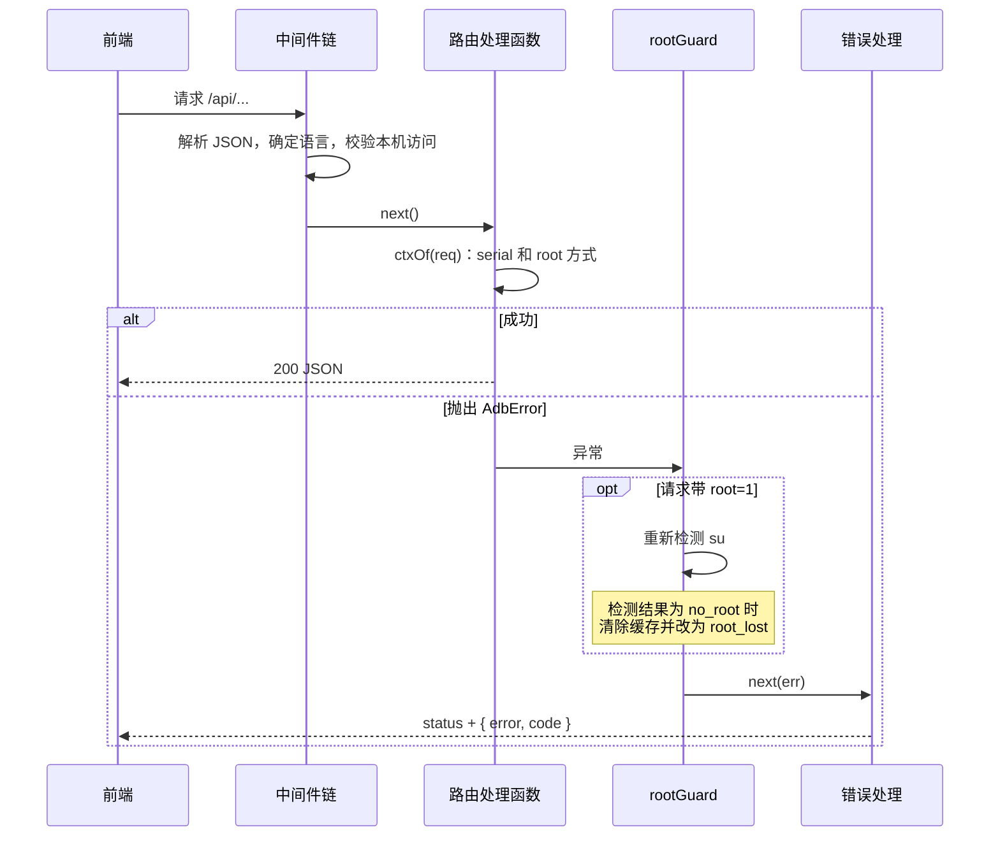

## 前端结构

前端分为外壳和模块两层。外壳负责设备、root 模式、语言、主题、提示、对话框、任务队列和模块导航；每个功能模块是一个整页，文件管理是第一个模块（`src/modules/files/`），应用管理是第二个（`src/modules/apps/`），prop 管理是第三个（`src/modules/props/`）。`main.tsx` 依次包裹 `QueryClientProvider`、`I18nProvider` 和 `MotionConfig`，然后渲染 `App`。`App.tsx` 只负责组装：调用 `useShellState()` 得到外壳状态，加上模块导航后放进 `ShellContext`，渲染当前模块的 `Page`，并在页面之外渲染全局浮层（`TaskQueue`、`Toast`、`Dialog`）。

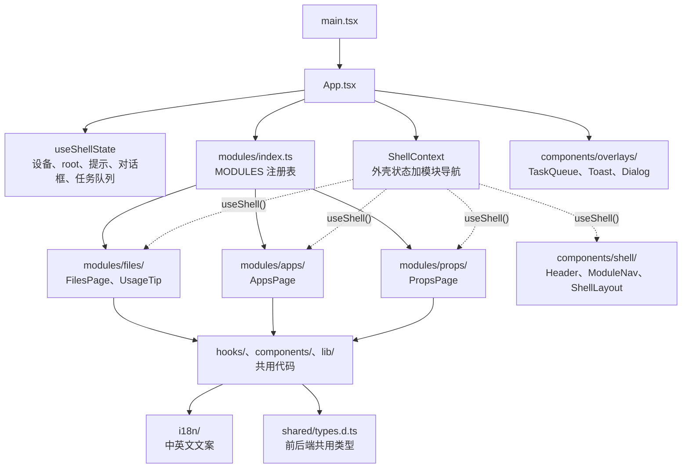

目录布局：

```
src/
  App.tsx                 组装外壳和当前模块
  modules/
    index.ts              模块注册表 MODULES（id、图标、名称键、Page、可选的 Tip）
    files/                文件管理模块
      index.ts            对外只导出 FilesPage、UsageTip
      FilesPage.tsx       文件管理的整页
      types.ts            Listing、TreeRow、ViewMode、Clip
      hooks/              文件管理的状态与交互逻辑
      components/         bookmarks/ toolbar/ views/ viewer/ overlays/ 和 UploadInputs.tsx
      lib/                archive、bookmarks、code、drop、entries、kinds、markdown，以及目录和文件相关的查询
    apps/                 应用管理模块
      index.ts            对外只导出 AppsPage
      AppsPage.tsx        应用管理的整页：宽屏左列表右详情，窄屏选中后详情替换列表
      types.ts            AppFilter
      hooks/              useApps：查询、筛选、搜索和选中的应用；useAppOps：安装、卸载、停用等操作
      components/         AppToolbar、AppList、AppDetail、AppActions、AppBadge
      lib/                filter（筛选和计数）、install（安装文件的类型判断和分组）、queries（["apps", serial] 和 ["app", serial, pkg]）
    props/                prop 管理模块
      index.ts            对外只导出 PropsPage
      PropsPage.tsx       prop 管理的整页：工具行加通用的 KeyValueTable
      types.ts            PropGroup
      hooks/              useProps：查询、分组、搜索和数量；usePropOps：修改、新建、删除，以及 needs_force 的强确认
      components/         PropToolbar
      lib/                groups（分组、过滤、计数）、queries（["props", serial, root]）
  hooks/                  共用：useDevices useReauthorize useRootMode useToast useTasks useShell useFileDrop
  components/
    shell/                Header DeviceSelect LanguagePicker ThemePicker ModuleNav ShellLayout
    overlays/             共用浮层：ContextMenu Dialog DialogMessage DropOverlay Toast TaskQueue
    NoDevice.tsx ui.tsx（含 SearchField、Segmented） KeyValueTable.tsx（通用键值表格，prop 管理使用，settings 管理复用）
  lib/                    共用：api prefs format theme favicon tasks（任务快照转卡片补丁），以及只含 queryClient 的 queries.ts
  i18n/  test/  types.ts
```

依赖规则：

- 模块可以导入 `src/hooks`、`src/components`、`src/lib`、`src/i18n` 和 `src/types.ts`；共用代码不导入 `modules/`，模块之间也不互相导入
- 唯一的例外是 `components/overlays/Dialog.tsx`：`bookmark` 类型的对话框内嵌文件模块的 `BookmarkForm`（并使用 `BookmarkFields` 类型）。其他模块的表单用通用的 `form` 类型（`DialogField` 列表，见下文），不再增加例外
- `hooks/` 和 `components/` 之间只允许导入类型（`import type`），模块内部的 `hooks/` 和 `components/` 同样如此；`lib/` 不依赖 `hooks/` 和 `components/`
- `hooks/`、`lib/` 和 `components/` 的各子目录（包括模块内部的同名目录）都有 `index.ts` 桶文件，目录外的模块从桶文件导入，例如 `../lib/index.ts`。桶文件仅重导出被目录外使用的模块，`viewer/` 中懒加载的 `CodeView` 和 `MarkdownView` 不在其中，以保持分包。`lib/` 与 `i18n/` 互相依赖，二者之间保持直接导入

### 外壳与模块

`ShellContext` 的值（`Shell`，见 `hooks/useShell.ts`）：

| 字段 | 含义 |
| --- | --- |
| `devices`、`adbError`、`fastbootMissing`、`serial`、`setSerial` | 设备列表、adb 错误、fastboot 是否缺失、当前序列号 |
| `device`、`reconnecting` | 当前设备；它消失后在 `REBOOT_GRACE`（90 秒）内保留选择，`device` 为最近一次出现时的条目，`reconnecting` 为 `true` |
| `adbReady` | 当前设备能执行 adb shell：`transport` 为 `adb`、`mode` 为 `system` 且不在重新连接中。存储用量、root 模式、顶栏的 ROOT 标记和 root 开关依赖它，与当前模块无关 |
| `online` | 当前设备可供当前模块使用：有设备、不在重新连接中，且 `mode` 在当前模块的 `modes` 内。由 `App` 按当前模块计算，`useShellState` 不包含 |
| `modes` | 当前模块可用的设备模式（`ModuleDef.modes`），由 `App` 提供，`useShellState` 不包含 |
| `storage`、`refreshStorage` | 当前设备的存储空间 |
| `rootMode`、`askEnableRoot`、`disableRoot` | root 模式开关及其对话框 |
| `target` | 当前设备加 root 方式（`{ serial, root }`），没有设备时为 `null` |
| `toast`、`flash` | 顶部提示 |
| `dialog`、`openDialog`、`closeDialog` | 当前对话框；`closeDialog` 传入打开的那个对话框时，只有它仍是当前对话框才关闭 |
| `tasks`、`startTask`、`patchTask`、`dismissTask` | 任务队列 |
| `nav` | 模块导航（`items`、`current`、`onChange`），由 `App` 根据 `MODULES` 生成，`useShellState` 不包含 |

`useShell()` 在没有 Provider 时抛出错误。外壳回调保持稳定，整个值用 `useMemo`。

新增模块的步骤：在 `modules/<名称>/` 下建立页面，页面用 `ShellLayout` 作为骨架，从 `useShell()` 取设备和任务队列；在 `modules/index.ts` 的 `MODULES` 中加一项（`ModuleId` 联合类型、图标、`nav.*` 文案键、`modes`、`Page`，需要时加 `Tip`）。`modes` 声明模块可用的设备模式，当前设备处于其他模式时页面显示 `NoDevice` 的模式提示。`ModuleNav` 仅在模块多于一个时显示，当前模块记录在 `afm.module`，存储的 id 无效时回退到第一个模块。切换模块时页面卸载，模块在 `window` 上注册的监听（例如 `useShortcuts`）随之移除。

`ShellLayout` 提供 `min-h-dvh` 容器、`max-w-6xl` 列、顶栏、模块导航和主面板，页面通过 `dropProps`（整窗拖放）、`children`（面板内容）、`panelOverlay`（面板内的绝对定位提示）和 `overlays`（页面自己的浮层）填充。浮层放在面板外面，不能放进带 transform 的元素，否则 `fixed` 定位会失效。

### 状态归属

| hook | 位置 | 管理的状态 | 持久化（localStorage） |
| --- | --- | --- | --- |
| `useShell` / `useShellState` | `hooks/` | 组合下列外壳 hook 和对话框状态，提供 `ShellContext` | 无 |
| `useDevices` | `hooks/` | 设备列表、当前设备、重新连接状态、adb 错误、fastboot 是否缺失；每 2 秒轮询 | 无 |
| `useReauthorize` | `hooks/` | 待授权时“重新请求授权”“重启 adb 服务”的进行状态和错误 | 无 |
| `useStorage` | `hooks/` | 当前设备的存储空间 | 无 |
| `useRootMode` | `hooks/` | root 模式开关、已验证的设备，以及 root 模式下的标签页标题和图标 | `afm.rootRemember` |
| `useTasks` | `hooks/` | 任务队列 | 无 |
| `useToast` | `hooks/` | 顶部提示 | 无 |
| `useFileDrop` | `hooks/` | 拖着文件经过窗口时的状态，放下后把 `DataTransfer` 交给调用方；文件模块用它上传，应用模块用它安装 | 无 |
| `useSelection` | `modules/files/hooks/` | 选中的路径、连选起点 | 无 |
| `useSelectionActions` | `modules/files/hooks/` | 单击、Shift 连选、Cmd / Ctrl 多选、全选、方向键 | 无 |
| `useDirectory` | `modules/files/hooks/` | 当前路径、筛选、目录内容和加载状态 | `afm.path` |
| `useListings` | `modules/files/hooks/` | 当前目录以外需要显示的目录（分栏视图的各栏、列表视图展开的文件夹） | 无 |
| `useTree` | `modules/files/hooks/` | 列表视图中展开的文件夹及展开后的行 | 无 |
| `useClipboard` | `modules/files/hooks/` | 应用内剪贴板（剪切或拷贝的条目及其所属设备） | 无 |
| `useBookmarks` | `modules/files/hooks/` | 书签列表及其对话框 | `afm.bookmarks` |
| `useFileOps` | `modules/files/hooks/` | 上传、下载、粘贴、解压、压缩，以及删除、重命名、新建文件夹的对话框 | `afm.rootDeleteNoWarn` |
| `useProperties` | `modules/files/hooks/` | 属性页要查看的条目 | 无 |
| `useViewer` | `modules/files/hooks/` | 查看器打开的文件、在可切换文件中的位置；切换时同步选中，掉线或切换设备后关闭 | 无 |
| `useMediaPlayer` | `modules/files/hooks/` | 查看器中视频、音频的播放状态、自动播放、音量和静音；空格键播放或暂停 | `afm.volume`、`afm.muted` |
| `useShortcuts` | `modules/files/hooks/` | 全局快捷键（无状态，读取最新的上下文）；对话框、菜单、属性页或查看器打开时不响应；仅在文件模块激活时注册 | 无 |
| `useUploadPicker` | `modules/files/hooks/` | 文件选择框 | 无 |
| `useApps` | `modules/apps/hooks/` | 应用列表查询、筛选项、搜索词、选中的包名；换设备时清空选择 | `afm.apps.filter` |
| `useProps` | `modules/props/hooks/` | 属性列表查询（含 `resetprop` 是否可用）、分组、搜索词；换设备时清空搜索 | `afm.props.group` |
| `usePropOps` | `modules/props/hooks/` | 修改和新建（表单对话框）、删除；先不带 `force` 提交，`ApiError` 的 `code` 为 `needs_force` 时换成 danger 确认框（后端给出的风险说明加 5 秒倒计时），确认后带 `force: true` 重试；成功后让 `["props", serial]` 失效 | 无 |
| `useAppOps` | `modules/apps/hooks/` | 安装（每组一张任务卡片，按顺序执行）、强行停止、启用、恢复，以及停用、清除数据、卸载、卸载更新的确认对话框（关键包为强确认）、提取 APK；成功后让 `["apps", serial]` 和 `["app", serial, pkg]` 失效 | 无 |

`App.tsx` 用 `usePref` 保存当前模块（`afm.module`）；`FilesPage.tsx` 中用 `usePref` 保存视图（`afm.view`）、排序（`afm.sort`）和隐藏文件开关（`afm.hidden`）；`useApps` 保存应用筛选项（`afm.apps.filter`，默认“用户”）；`useProps` 保存属性分组（`afm.props.group`，默认“全部”）。其他持久化项：界面语言 `afm.lang`，主题 `afm.flavor`、`afm.accent`，首次使用提示 `afm.tipDismissed`；`TextViewer` 用 `usePref` 保存文本查看的自动换行开关 `afm.textWrap` 和 Markdown 预览开关 `afm.markdownPreview`。

### 目录缓存

目录内容由 TanStack Query 缓存，查询键为 `["ls", serial, root, path]`（`modules/files/lib/queries.ts`；`queryClient` 及其默认设置在共用的 `lib/queries.ts`）。当前目录、分栏视图的各栏和列表视图展开的文件夹共用同一份缓存：

- 进入缓存中已有的目录时立即显示缓存内容，同时在后台重新加载
- 新建、重命名、删除、粘贴、上传之后，`useDirectory` 的 `afterChange` / `reload` 删除已不存在的目录的缓存，其余目录标记为过期，正在显示的目录随即重新加载
- 若当前目录本身或其上层被改名、移动或删除，`afterChange` 会跳转到新路径或上一级
- 查询不重试，切回窗口时不自动刷新

### 前端模块依赖

hooks 之间及 hooks 与 `lib/` 的依赖如下。所有 hook 和组件都通过 `useT` / `useI18n` 使用 `i18n/index.tsx`，图中省略这部分连线。

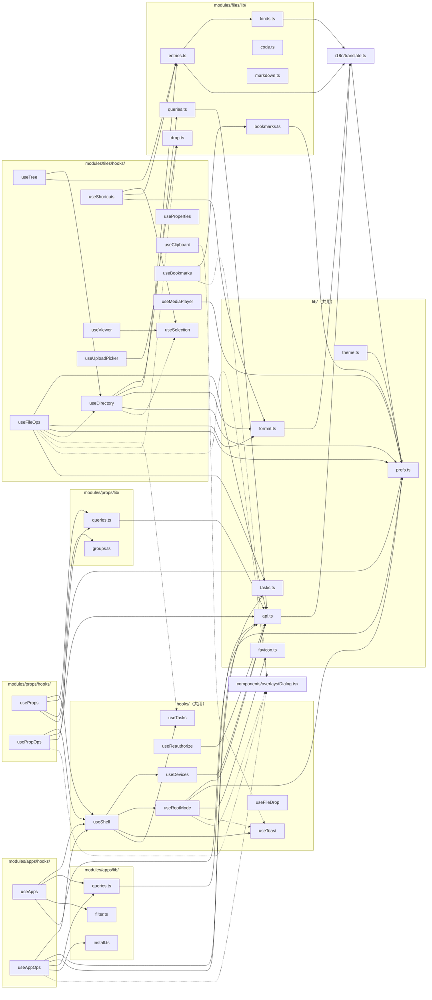

组件按目录分组后的依赖：

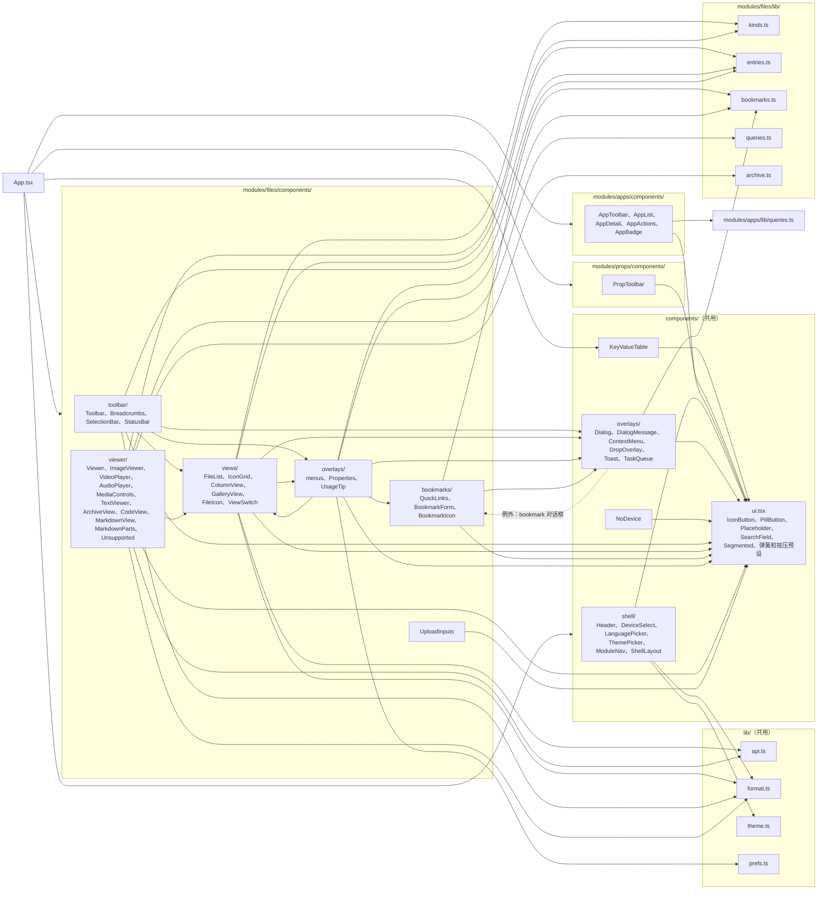

说明：

- `views/` 中仅 `ColumnView` 和 `GalleryView` 依赖 `api.ts`，用于生成图片预览地址（`api.previewUrl`）
- `viewer/` 使用 `views/FileIcon.tsx` 显示文件图标；媒体元素直接以 `api.previewUrl` 为地址，文本经 `modules/files/lib/queries.ts` 的 `textQuery` 读取，再由 `CodeView`（CodeMirror 6，只读，首次打开文本时懒加载）显示，语言识别和主题配色在 `modules/files/lib/code.ts`。播放状态来自 `FilesPage.tsx` 中的 `useMediaPlayer`，组件只导入其类型，媒体元素通过返回的 `attach` 挂上
- 压缩包（`modules/files/lib/kinds.ts` 的 `isArchive`，扩展名须与后端 `archiveFormat` 一致）在查看器中由 `ArchiveView` 显示：经 `archiveQuery` 读取条目，`archive.ts` 的 `archiveTree` 补齐中间目录并排序，`flattenTree` 按展开状态输出可见的行，`treeStats` 统计文件数、文件夹数和总大小。只列条目，不预览内部文件。7z、rar、xz 不在支持范围内，仍走文本查看器
- Markdown 文件（`kinds.ts` 的 `isMarkdown`）默认由 `MarkdownView` 渲染为排版后的预览，同样懒加载，`vite.config.ts` 把 unified 生态的依赖单独分为 `markdown` 块，避免并入首屏。渲染链路为 react-markdown，加 remark-gfm（表格、任务列表、删除线、脚注）、rehype-raw 和 rehype-sanitize（GitHub 风格白名单，净化原始 HTML）；各标签的样式在 `MarkdownView` 的 `components` 映射里用 Tailwind 类名写出。代码块由 `MarkdownParts` 的 `CodeBlock` 接管，经 `code.ts` 的 `languageForFence` 和 `highlightLines` 复用源码视图的语言识别和配色，`codeHighlightCss` 提供对应的样式规则。链接和图片的路径解析、标题锚点在 `markdown.ts`：指向设备上其他文件的相对链接不可点击，相对路径的图片按 md 所在目录解析，经 `api.previewUrl` 读取
- 文件模块的 `overlays/menus.tsx` 引用 `views/ViewSwitch.tsx` 中的视图列表；`Toolbar` 和 `ViewSwitch` 引用共用 `ContextMenu` 的菜单类型
- `overlays/Properties*.tsx` 和 `PermissionEditor.tsx` 经 `queries.ts` 的 `statQuery`、`usageQuery` 读取数据，修改权限和所有者时直接调用 `api.chmod`、`api.chown` 后让 `statQuery` 缓存失效；`usageQuery` 在查询函数内先等待 500 毫秒再请求，关闭属性页时随查询一起取消
- 对话框有 `prompt`、`confirm`、`form` 和 `bookmark` 四种。`form` 是通用表单：`fields` 是 `DialogField` 列表（`label`、`initial`，可选 `readOnly`、`required`、`trim`、`mono`），可带 `message` 说明，`onSubmit(values)` 按字段顺序接收字符串；第一个可编辑项自动聚焦并选中内容，必填项为空（含全空白）时确认按钮不可用。`onSubmit` 抛出的错误显示在表单内。提交过程中可以用 `openDialog` 换成另一个对话框（例如 `needs_force` 的强确认），原对话框随后的关闭不会影响新的对话框，因为 `closeDialog` 只关闭仍是当前的那个
- `components/KeyValueTable.tsx` 是通用键值表格（`rows`、`loading`、`loadingText`、`error`、`emptyText`、`canEdit`、`onEdit`，可选 `onDelete`、`badge`）：键名等宽，值可换行，每行有拷贝键名、拷贝值、修改和删除按钮（悬停或聚焦时显示），行的 `key` 是键名；超过 200 行时不做布局动画；空、加载、错误状态复用 `Placeholder`。prop 管理使用它，settings 管理直接复用。`ui.tsx` 的 `SearchField`（带清除按钮的搜索框）和 `Segmented`（带数量的单选分段控件，`layoutId` 由调用方给出）由应用和 prop 管理的工具行共用
- 共用的 `components/overlays/Dialog.tsx` 内嵌文件模块的 `bookmarks/BookmarkForm.tsx` 编辑书签，这是共用代码导入模块的唯一例外；`bookmarks/QuickLinks.tsx` 引用 `ContextMenu` 的菜单类型

## 主要流程

### 打开目录

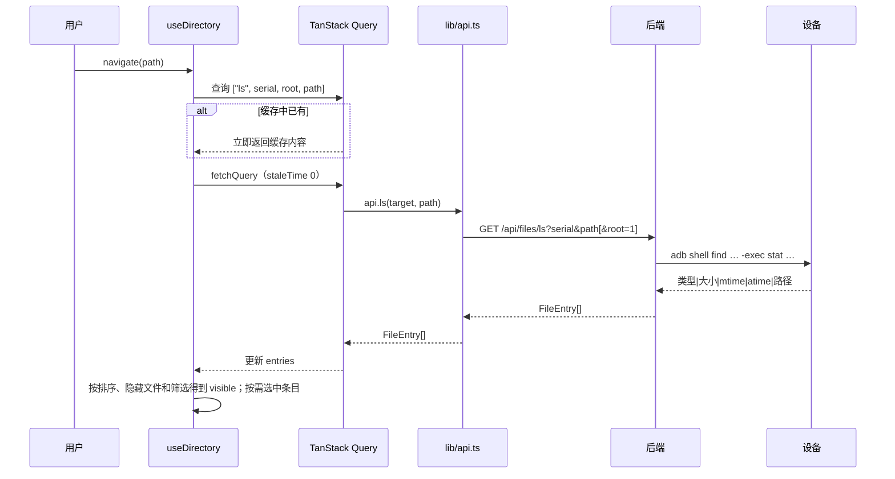

### 上传

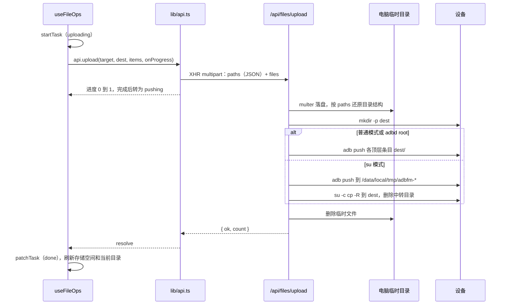

### 下载

下载分两步：先启动下载任务，任务的结果是一次性 token，再由浏览器通过 `<a download>` 访问 `/api/files/fetch/:token` 取回。

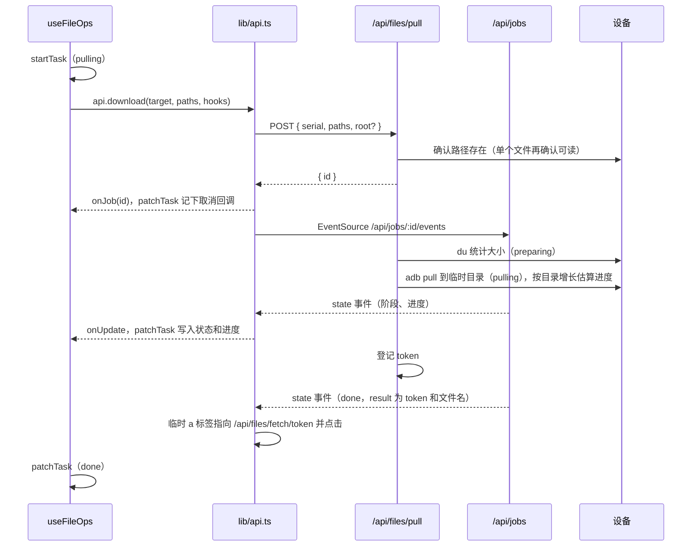

单个文件在任务里只登记 token，不经过电脑临时目录，任务立即完成；取回时用 `adb exec-out cat` 流式返回，浏览器立即开始下载。目录或多项在任务中 `adb pull` 到临时目录，取回时打包为 zip，响应结束后临时目录即被删除。用户取消时，`cancelJob` 触发任务的 `signal`，`adb pull` 被终止，临时目录随即删除，任务卡片显示“已取消”。未取回的 token 30 分钟后清理。

### 解压

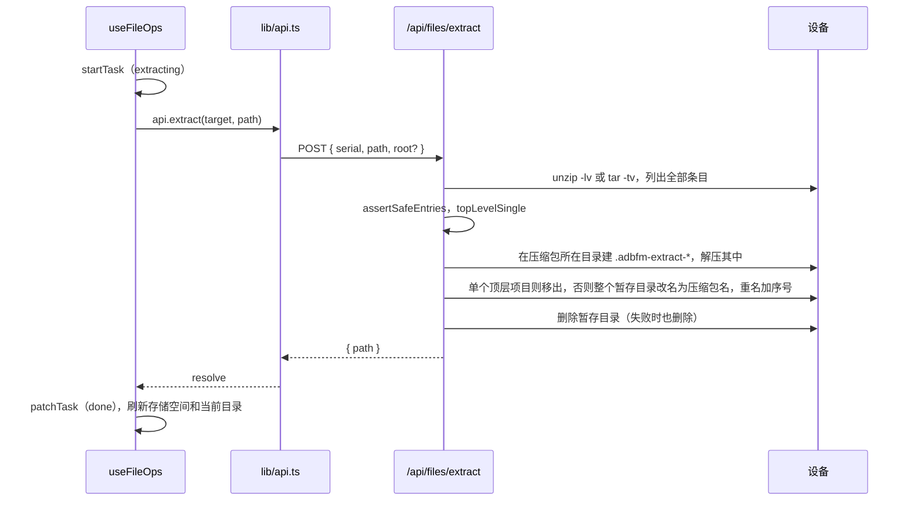

解压失败时（含安全检查不通过）任务显示错误，并刷新当前目录，因为中途失败时可能已经解出了一部分。

### 压缩

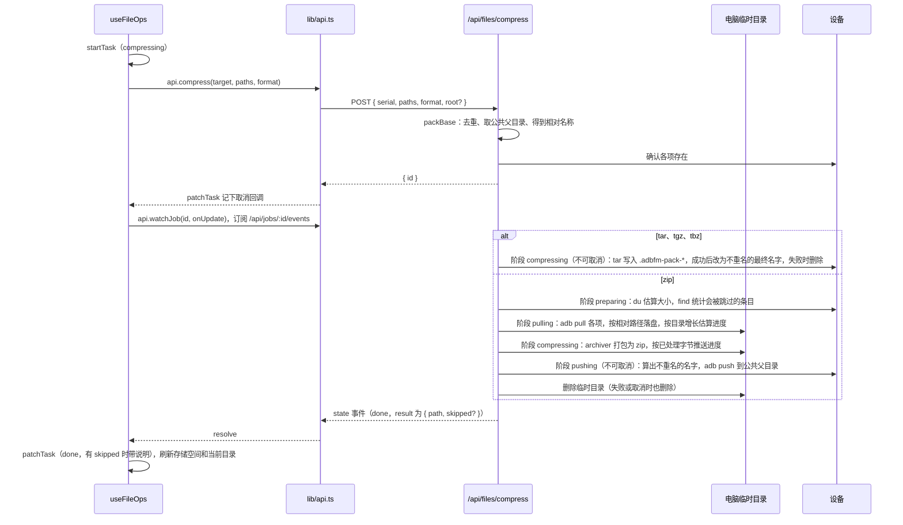

压缩失败或被取消时，任务卡片分别显示错误和“已取消”，并刷新当前目录。zip 有被跳过的条目时，任务卡片显示说明且不会自动消失。

### root 模式


## 测试

测试使用 Vitest，`vitest.config.ts` 中分为两个项目：

| 项目 | 范围 | 环境 |
| --- | --- | --- |
| `server` | `server/**/*.test.ts` | Node.js |
| `web` | `src/**/*.test.{ts,tsx}` | jsdom，加载 `src/test/setup.ts` |

两个项目都使用 `vmThreads` 池，每个 worker 只创建一次 jsdom，同时保留文件级隔离，全量测试耗时约从 11 秒降到 7 秒。

前端测试的约定：

- 测试文件与被测模块放在同一目录，命名为 `*.test.ts`（hooks）或 `*.test.tsx`（组件）
- `src/test/setup.ts` 关闭 Motion 动画、补齐 jsdom 缺少的滚动方法，并在每个测试前清空 localStorage、将界面语言固定为中文
- `src/test/utils.tsx` 提供 `providers`（I18n 及可选的 QueryClient）、`tz`（从中文词典取期望文案，修改文案时无需修改测试）、`file` / `folder`（构造条目）和 `deferred`（手动控制完成时机的 Promise）
- 与后端的交互通过 `vi.spyOn(api, "...")` 替换 `lib/api.ts` 中的方法；需要验证 `root_lost` 等底层行为时替换 `fetch`
- 依赖 TanStack Query 的 hook 每个测试使用新的 `QueryClient`，互不影响

运行方式：

```bash
pnpm test                       # 全部测试
pnpm vitest run --project web   # 仅前端
pnpm vitest --project web       # 前端监听模式
```
