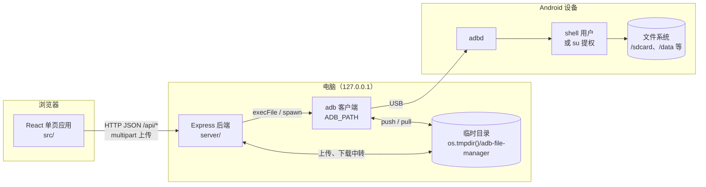
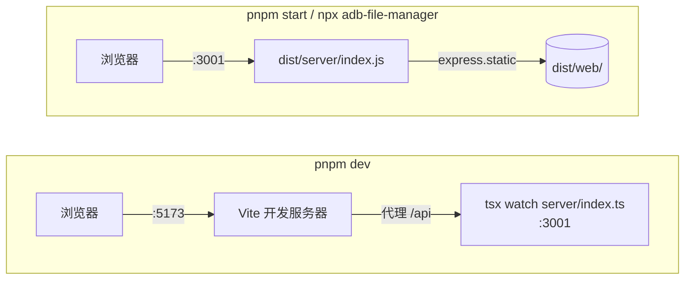
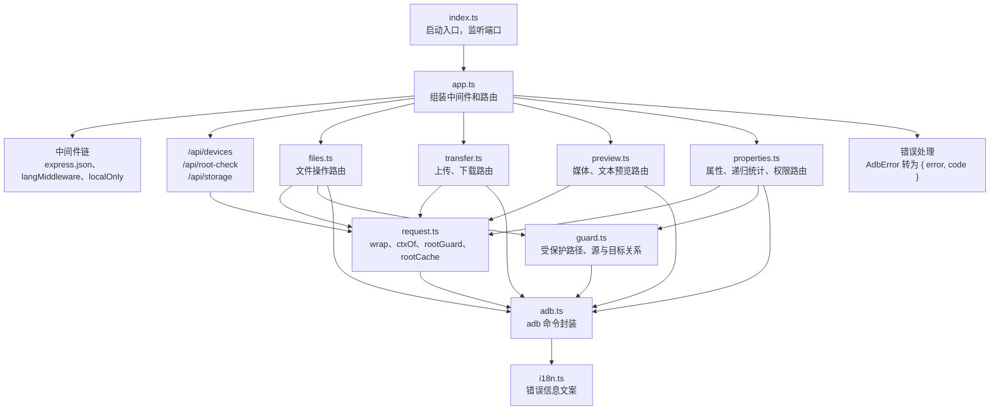
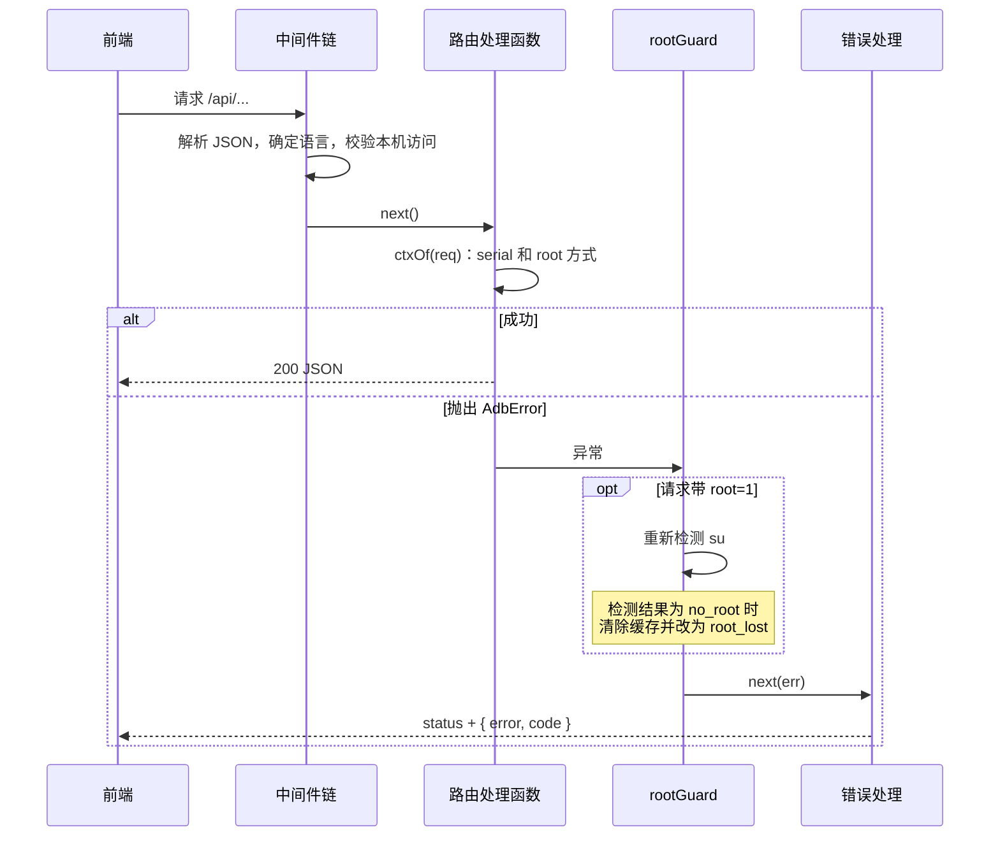
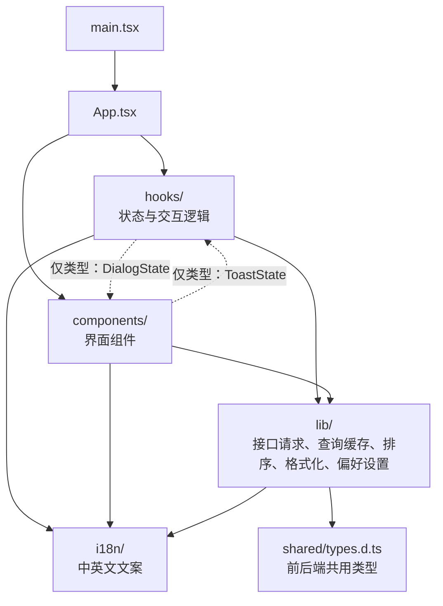
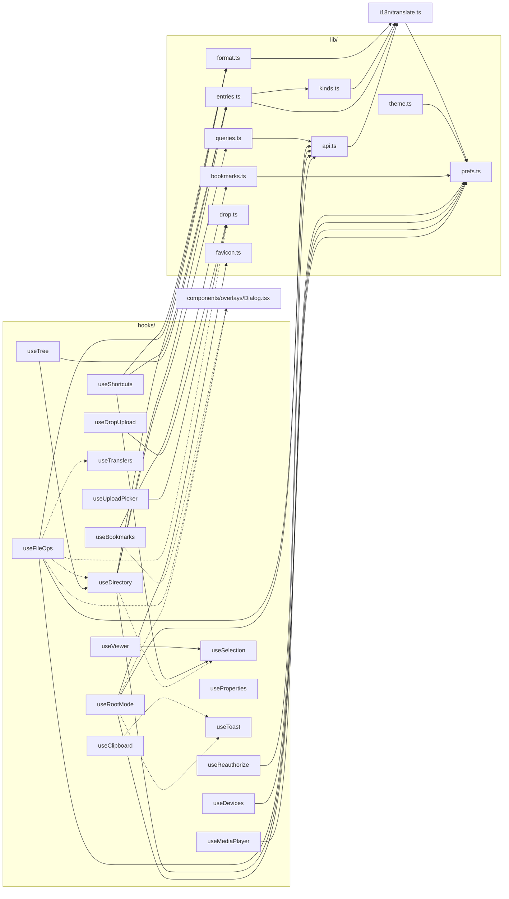
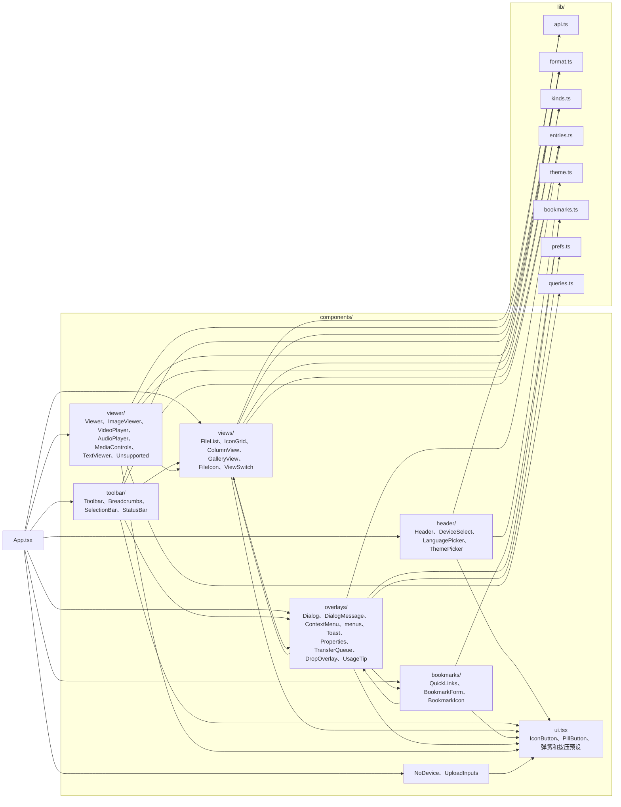
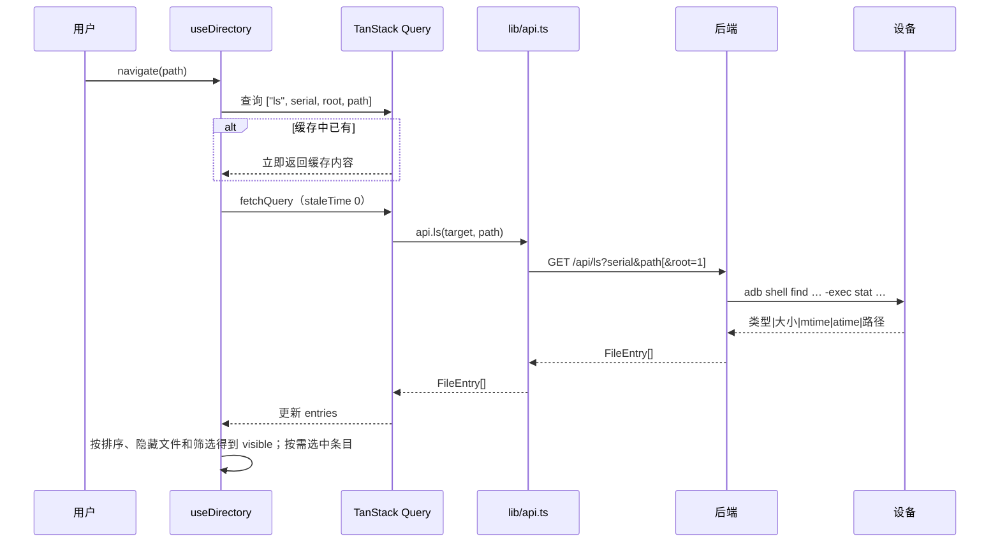
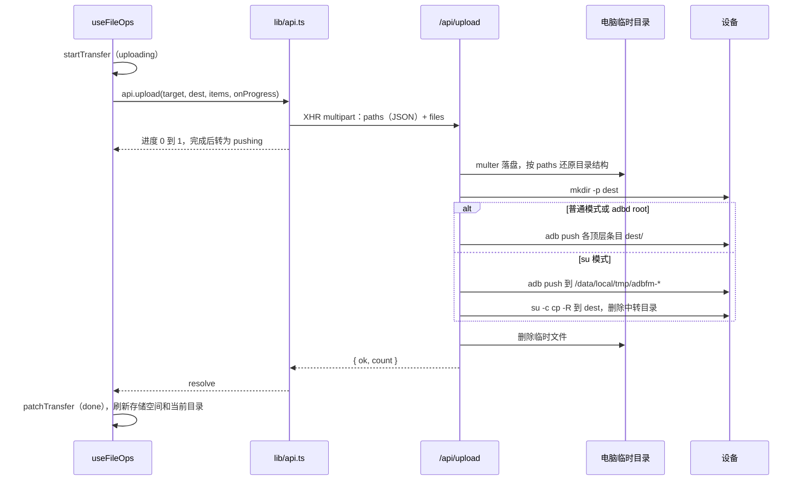
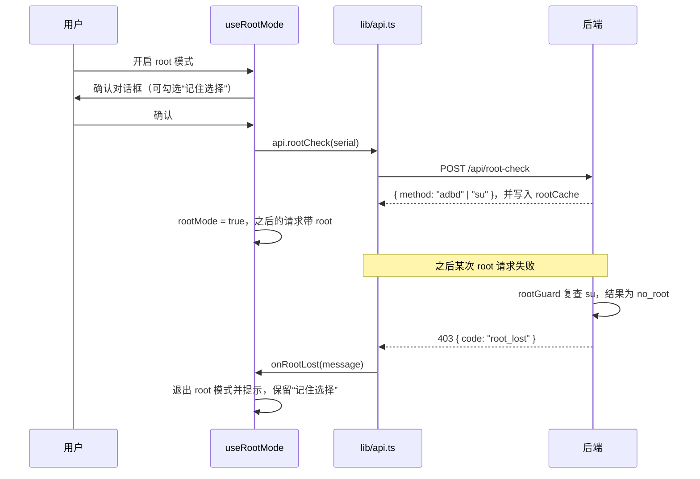

# 架构说明

本文档说明 ADB File Manager 的整体结构、主要数据流和模块依赖关系。接口细节见 [API 文档](api.md)。

## 整体架构

工具由三部分组成：浏览器中运行的前端单页应用、电脑上运行的 Node.js 后端，以及通过 USB 连接的 Android 设备。前端不直接接触 adb，所有设备操作都经后端转换为 adb 命令执行。



要点：

- 后端只监听 `127.0.0.1`，并通过 `guard.ts` 中的 `localOnly` 校验 Host、Origin 和 Sec-Fetch-Site，拒绝来自其他主机或其他网页的请求
- 列目录、新建、重命名、删除、复制、移动均通过 `adb shell` 在设备端执行；路径在拼接进命令前经过单引号转义（`adb.ts` 中的 `q`）
- 上传和下载经电脑临时目录中转：上传先由 multer 接收到临时目录，再 `adb push`；下载先 `adb pull` 到临时目录，再由浏览器取回
- 预览（含 Range 分段读取）使用 `adb exec-out` 直接以字节流返回，不经过临时目录；文本预览读取文件开头 1 MB
- root 模式下，若 adbd 本身以 root 运行则直接执行；否则以 `su -c`（可由 `ADBFM_SU` 修改）包装命令。su 模式下 `adb push` / `adb pull` 本身没有 root 权限，因此再经设备上的 `/data/local/tmp` 中转一次

### 开发与生产两种运行方式



开发时页面由 Vite 提供，`/api` 请求代理到 3001 端口的后端。构建后后端同时托管 `dist/web/` 中的前端产物，`/api/` 以外的路径一律返回 `index.html`。

## 后端结构



| 模块 | 职责 |
| --- | --- |
| `index.ts` | 读取 `PORT`，在 `127.0.0.1` 上启动服务 |
| `app.ts` | 注册中间件、设备相关的三个接口、四组路由、静态文件和统一的错误处理 |
| `files.ts` | `/api/ls`、`/api/mkdir`、`/api/rename`、`/api/delete`、`/api/copy`、`/api/move` |
| `preview.ts` | `/api/preview`（媒体文件，支持 Range）、`/api/text`（文件开头 1 MB 的 UTF-8 文本）；`parseRange`、`decodeText` 为可单独测试的纯函数 |
| `properties.ts` | `/api/stat`（属性、符号链接目标、所在分区）、`/api/usage`（文件夹递归统计，可取消，超时 120 秒）、`/api/chmod`、`/api/chown`；`parseStat`、`parsePartition`、`parseUsage` 为可单独测试的纯函数，`stat -c` 的格式依次降级以兼容老设备 |
| `transfer.ts` | `/api/upload`、`/api/pull`、`/api/fetch/:token`；管理下载任务和临时目录 |
| `request.ts` | 解析 `serial`、`root`、`paths` 参数；缓存每台设备的 root 方式；root 请求失败时复查并转换为 `root_lost` |
| `guard.ts` | 仅限本机访问；禁止删除、移动，以及修改权限或所有者的目标为根目录、一级目录、存储根目录等路径；禁止把目录复制或移动到自身内部 |
| `adb.ts` | 调用 adb，解析 `adb devices`、`find` + `stat` 的输出；封装 push、pull、复制、改名、删除、chmod、chown，以及按字节读取文件（`cat`、`head`、`fileSize`）等操作 |
| `i18n.ts` | 按请求头 `X-Lang`（缺省时看 `Accept-Language`）选择错误信息语言，基于 `AsyncLocalStorage` 在请求范围内生效 |

### 一次请求的处理过程

所有异步路由都用 `wrap` 包装。处理函数抛出的异常交给 `rootGuard` 复查后再进入错误处理中间件：



## 前端结构

`main.tsx` 依次包裹 `QueryClientProvider`、`I18nProvider` 和 `MotionConfig`，然后渲染 `App`。`App.tsx` 本身只负责组装：状态和交互逻辑在 `hooks/` 中，界面在 `components/` 中，与界面无关的工具函数在 `lib/` 中。



实线表示运行时依赖，虚线表示仅导入类型（`import type`），编译后不产生依赖。`lib/` 不依赖 `hooks/` 和 `components/`。

### 状态归属

| hook | 管理的状态 | 持久化（localStorage） |
| --- | --- | --- |
| `useDevices` | 设备列表、当前设备、adb 错误；每 2 秒轮询 | 无 |
| `useReauthorize` | 待授权时“重新请求授权”“重启 adb 服务”的进行状态和错误 | 无 |
| `useStorage` | 当前设备的存储空间 | 无 |
| `useRootMode` | root 模式开关、已验证的设备，以及 root 模式下的标签页标题和图标 | `afm.rootRemember` |
| `useSelection` | 选中的路径、连选起点 | 无 |
| `useSelectionActions` | 单击、Shift 连选、Cmd / Ctrl 多选、全选、方向键 | 无 |
| `useDirectory` | 当前路径、筛选、目录内容和加载状态 | `afm.path` |
| `useListings` | 当前目录以外需要显示的目录（分栏视图的各栏、列表视图展开的文件夹） | 无 |
| `useTree` | 列表视图中展开的文件夹及展开后的行 | 无 |
| `useClipboard` | 应用内剪贴板（剪切或拷贝的条目及其所属设备） | 无 |
| `useBookmarks` | 书签列表及其对话框 | `afm.bookmarks` |
| `useFileOps` | 上传、下载、粘贴，以及删除、重命名、新建文件夹的对话框 | `afm.rootDeleteNoWarn` |
| `useProperties` | 属性页要查看的条目 | 无 |
| `useTransfers` | 传输队列 | 无 |
| `useToast` | 顶部提示 | 无 |
| `useViewer` | 查看器打开的文件、在可切换文件中的位置；切换时同步选中，掉线或切换设备后关闭 | 无 |
| `useMediaPlayer` | 查看器中视频、音频的播放状态、自动播放、音量和静音；空格键播放或暂停 | `afm.volume`、`afm.muted` |
| `useShortcuts` | 全局快捷键（无状态，读取最新的上下文）；对话框、菜单、属性页或查看器打开时不响应 | 无 |
| `useUploadPicker` / `useDropUpload` | 文件选择框、拖放上传 | 无 |

`App.tsx` 中还用 `usePref` 保存视图（`afm.view`）、排序（`afm.sort`）和隐藏文件开关（`afm.hidden`）。其他持久化项：界面语言 `afm.lang`，主题 `afm.flavor`、`afm.accent`，首次使用提示 `afm.tipDismissed`；`TextViewer` 用 `usePref` 保存文本查看的自动换行开关 `afm.textWrap`。

### 目录缓存

目录内容由 TanStack Query 缓存，查询键为 `["ls", serial, root, path]`（`lib/queries.ts`）。当前目录、分栏视图的各栏和列表视图展开的文件夹共用同一份缓存：

- 进入缓存中已有的目录时立即显示缓存内容，同时在后台重新加载
- 新建、重命名、删除、粘贴、上传之后，`useDirectory` 的 `afterChange` / `reload` 删除已不存在的目录的缓存，其余目录标记为过期，正在显示的目录随即重新加载
- 若当前目录本身或其上层被改名、移动或删除，`afterChange` 会跳转到新路径或上一级
- 查询不重试，切回窗口时不自动刷新

### 前端模块依赖

hooks 之间及 hooks 与 `lib/` 的依赖如下。所有 hook 和组件都通过 `useT` / `useI18n` 使用 `i18n/index.tsx`，图中省略这部分连线。



组件按目录分组后的依赖：



说明：

- `views/` 中仅 `ColumnView` 和 `GalleryView` 依赖 `api.ts`，用于生成图片预览地址（`api.previewUrl`）
- `viewer/` 使用 `views/FileIcon.tsx` 显示文件图标；媒体元素直接以 `api.previewUrl` 为地址，文本经 `lib/queries.ts` 的 `textQuery` 读取。播放状态来自 `App.tsx` 中的 `useMediaPlayer`，组件只导入其类型，媒体元素通过返回的 `attach` 挂上
- `overlays/menus.tsx` 引用 `views/ViewSwitch.tsx` 中的视图列表；`Toolbar` 和 `ViewSwitch` 引用 `ContextMenu` 的菜单类型
- `overlays/Properties*.tsx` 和 `PermissionEditor.tsx` 经 `lib/queries.ts` 的 `statQuery`、`usageQuery` 读取数据，修改权限和所有者时直接调用 `api.chmod`、`api.chown` 后让 `statQuery` 缓存失效；`usageQuery` 在查询函数内先等待 500 毫秒再请求，关闭属性页时随查询一起取消
- `overlays/Dialog.tsx` 内嵌 `bookmarks/BookmarkForm.tsx` 编辑书签，`bookmarks/QuickLinks.tsx` 引用 `ContextMenu` 的菜单类型

## 主要流程

### 打开目录



### 上传



### 下载

下载分两步：先由后端 `adb pull` 到临时目录并返回一次性 token，再由浏览器通过 `<a download>` 访问 `/api/fetch/:token` 取回。单个文件原样返回，目录或多项打包为 zip。响应结束后临时目录即被删除；未取回的任务 30 分钟后清理。

### root 模式



## 测试

测试使用 Vitest，`vitest.config.ts` 中分为两个项目：

| 项目 | 范围 | 环境 |
| --- | --- | --- |
| `server` | `server/**/*.test.ts` | Node.js |
| `web` | `src/**/*.test.{ts,tsx}` | jsdom，加载 `src/test/setup.ts` |

前端测试的约定：

- 测试文件与被测模块放在同一目录，命名为 `*.test.ts`（hooks）或 `*.test.tsx`（组件）
- `src/test/setup.ts` 关闭 Motion 动画、补齐 jsdom 缺少的滚动方法，并在每个测试前清空 localStorage、将界面语言固定为中文
- `src/test/utils.tsx` 提供 `providers`（I18n 及可选的 QueryClient）、`tz`（从中文词典取期望文案，修改文案时无需修改测试）、`file` / `folder`（构造条目）和 `deferred`（手动控制完成时机的 Promise）
- 与后端的交互通过 `vi.spyOn(api, "...")` 替换 `lib/api.ts` 中的方法；需要验证 `root_lost` 等底层行为时替换 `fetch`
- 依赖 TanStack Query 的 hook 每个测试使用新的 `QueryClient`，互不影响

运行方式：

```bash
pnpm test                       # 全部测试
pnpm vitest run --project web   # 仅前端
pnpm vitest --project web       # 前端监听模式
```
